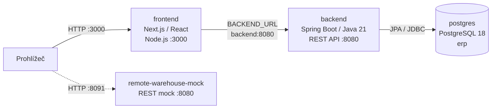

# Architektura ERP — Next.js (první React frontend)

Dokument popisuje nasazení definované v [`docker-compose-NEXTJS.yml`](./docker-compose-NEXTJS.yml).
Frontend `erp-base-nextjs` je samostatná první React/Next.js varianta. Spring
Boot backend a PostgreSQL zůstávají společnými vrstvami ERP.

## Přehled služeb



Všechny kontejnery jsou připojené k externí Docker síti `projects-network`.
Mock skladu není podle této konfigurace zapojený do požadavků backendu.

## Komponenty a odpovědnosti

| Služba | Image/build | Odpovědnost |
| --- | --- | --- |
| `frontend` | `./erp-base-nextjs` | Next.js App Router, React/TypeScript obrazovky a serverové směrování požadavků. |
| `backend` | `./erp-backend` | Spring Boot REST API, autentizace, autorizace, validace a aplikační pravidla. |
| `postgres` | `postgres:18` | Databáze `erp`, zdroj trvalých ERP dat. |
| `remote-warehouse-mock` | `./erp-remote-warehouse` | Samostatné HTTP API mocku skladu; jeho testovací data jsou v paměti. |

Frontend volá backend přes interní adresu `http://backend:8080`. Backend používá
`postgres:5432` a Compose čeká na databázový healthcheck před jeho spuštěním.
Přihlašovací session a košíky jsou uloženy na straně serveru; prohlížeč
neuchovává backendový bearer token.

## Síť, porty a perzistence

| Port hostitele | Kontejner | Účel |
| --- | --- | --- |
| `3000` | `frontend:3000` | Next.js ERP frontend |
| `8080` | `backend:8080` | REST API backendu |
| `5434` | `postgres:5432` | Přístup k PostgreSQL z hostitele |
| `8091` | `remote-warehouse-mock:8080` | API mocku skladu |

Databázová data jsou v pojmenovaném volume `erp-postgres-data`. Session data
frontend ukládá do `/app/var/sessions`, připojeného k volume
`erp-nextjs-sessions`. Souborové session úložiště je určeno pro jednu repliku
frontendu; horizontální škálování vyžaduje sdílené úložiště se synchronizací.
Mock skladu drží dataset pouze v paměti.

## Spuštění a přepnutí varianty

Před prvním spuštěním vytvořte externí síť:

```bash
docker network create projects-network
docker compose -f docker-compose-NEXTJS.yml up --build -d
```

Frontend je dostupný na `http://localhost:3000`, API na
`http://localhost:8080`. Compose varianty sdílejí publikované porty i název
databázového volume; nespouštějte je současně. Při přepínání zastavte
předchozí variantu jejím Compose souborem. Nepoužívejte `down -v`, pokud chcete
zachovat databázová a session data.

## Konfigurace pro nasazení

Compose nastavuje `BACKEND_URL`, `COOKIE_SECURE` (výchozí `false`) a
`SESSION_DIR`. Za HTTPS nastavte `COOKIE_SECURE=true` a chraňte session volume
jako citlivá runtime data. Databázová hesla v Compose jsou vývojové hodnoty;
pro nasazení použijte bezpečnou správu tajemství.
