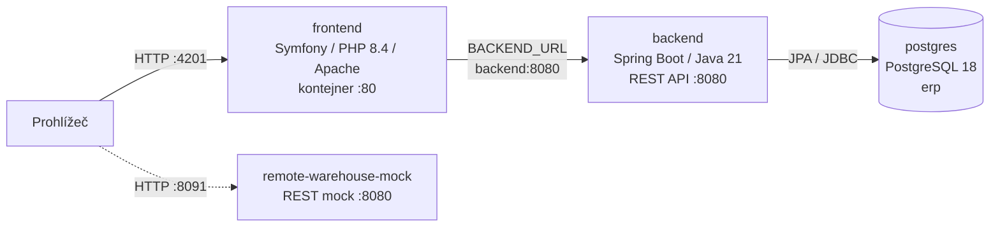

# Architektura ERP — PHP

Dokument popisuje nasazení definované v [`docker-compose-PHP.yml`](./docker-compose-PHP.yml).
Jde o třívrstvou aplikaci: Symfony frontend v PHP/Apache, Spring Boot backend
a PostgreSQL. Služba vzdáleného skladu je samostatný testovací mock.

## Přehled služeb



Všechny kontejnery jsou připojené k externí Docker síti `projects-network`.
Mock skladu není podle této konfigurace zapojený do požadavků backendu.

## Komponenty a odpovědnosti

| Služba | Image/build | Odpovědnost |
| --- | --- | --- |
| `frontend` | `./erp-base-php` | Symfony aplikace spuštěná přes Apache a PHP 8.4; veřejný adresář je document root. |
| `backend` | `./erp-backend` | Spring Boot REST API, aplikační pravidla a přístup k databázi. |
| `postgres` | `postgres:18` | Databáze `erp`, zdroj trvalých ERP dat. |
| `remote-warehouse-mock` | `./erp-remote-warehouse` | Samostatné HTTP API mocku skladu; jeho testovací data jsou v paměti. |

Backend čeká na úspěšný healthcheck PostgreSQL. Připojení používá v síti Compose
adresu `postgres:5432`; proměnná `BACKEND_URL` ukazuje frontendu na
`http://backend:8080`.

## Síť, porty a perzistence

| Port hostitele | Kontejner | Účel |
| --- | --- | --- |
| `4201` | `frontend:80` | Symfony webová aplikace |
| `8080` | `backend:8080` | REST API backendu |
| `5434` | `postgres:5432` | Přístup k PostgreSQL z hostitele |
| `8091` | `remote-warehouse-mock:8080` | API mocku skladu |

Compose deklaruje pojmenovaný volume `erp-postgres-data` pro PostgreSQL.
Pro PHP session data není definovaný samostatný pojmenovaný volume, takže
Compose negarantuje jejich uchování při nahrazení frontend kontejneru.
Mock skladu drží dataset pouze v paměti.

## Spuštění a přepnutí varianty

Před prvním spuštěním vytvořte externí síť:

```bash
docker network create projects-network
docker compose -f docker-compose-PHP.yml up --build -d
```

Web je dostupný na `http://localhost:4201`, API na `http://localhost:8080`.
Compose varianty sdílejí publikované porty i název databázového volume;
nespouštějte je současně. Při přepínání zastavte předchozí variantu jejím
Compose souborem. Nepoužívejte `down -v`, pokud chcete zachovat databázová data.

## Konfigurace pro nasazení

Compose soubor obsahuje vývojové přihlašovací údaje databáze přímo v YAML.
Před použitím mimo lokální vývoj je nahraďte bezpečnou správou tajemství
a omezte přístup k publikovaným portům.
