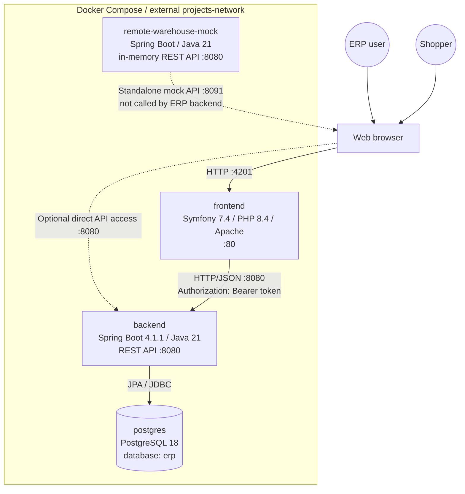
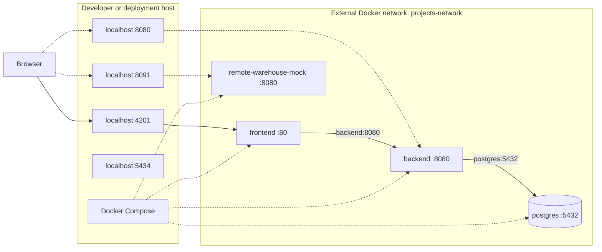

# ERP system architecture

This document describes the system currently defined by the root
`docker-compose.yml`. The ERP is a three-tier application with a separate
warehouse mock used as an optional integration surface.

## System context

The browser-facing application renders ERP pages on the server. The Symfony
frontend calls the Spring API over the Compose network; the browser can also
reach the published backend API directly. The warehouse mock is a separate
service and is not currently integrated into backend request flows.

## Runtime components

| Component | Runtime responsibility | Data ownership |
| --- | --- | --- |
| `frontend` (`erp-base-php`) | Apache serves the Symfony application; Twig renders module pages, Symfony sessions hold login state, and the backend HTTP client forwards API requests. | Browser session and short-lived backend bearer token. |
| `backend` (`erp-backend`) | Spring REST API, authentication and authorization, validation, business workflows, PDF generation, and persistence. | ERP business data and rules. |
| `postgres` | PostgreSQL database used by the backend. | Durable system of record in the `erp` database. |
| `remote-warehouse-mock` | Standalone mock API for warehouse/product/stock availability. | Static in-memory fixtures; data resets when the service restarts. |
| Flyway | Applies versioned database migrations at backend startup; Hibernate validates the mapped schema. | Schema history; 49 SQL migrations are currently checked in. |

The backend is a modular monolith: its modules run in one Spring Boot process
and share one PostgreSQL database. The frontend, backend, database, and mock
are separate Compose services, not separate business-domain microservices.

## Request and authentication flow

1. A user opens the ERP frontend at `http://localhost:4201`; public shop pages
   are also served by the frontend.
2. On login, the frontend sends credentials to the backend's `/api/v1/auth`
   API. The frontend stores the returned bearer token in its server-side
   session; it does not keep that token in the browser.
3. For authenticated actions and page data, the frontend's backend client
   sends HTTP/JSON requests to `http://backend:8080` and adds the session token
   as a bearer authorization header.
4. Spring controllers dispatch requests to module services and repositories.
   The backend enforces access rules and business validation.
5. The backend reads and writes PostgreSQL. Flyway manages schema changes and
   Hibernate checks that the database schema matches the entities.

The frontend and backend both expose HTTP endpoints. The backend is published
on the host for API access and development, in addition to being available to
the frontend on the internal Compose network.

## Application modules

| Business area | Backend modules | Frontend pages |
| --- | --- | --- |
| Identity and administration | `users`, `companies`, `settings` | Login, users, companies, roles, role modules, settings |
| Catalog and commerce operations | `catalog`, `purchase`, `inventory`, `sales`, `pos` | eCommerce, purchasing, inventory, sales, POS |
| Finance and campaigns | `accounting`, `promo`, `marketing` | Accounting, promotions, marketing |
| Workforce and delivery | `manufacturing`, `hr`, `planning`, `projects` | Manufacturing, HR, planning, projects |
| Customer and content | `crm`, `documents`, `helpdesk`, `website` | CRM, documents, helpdesk, website and public pages |
| Cross-module views | `dashboard` | Dashboard |

The backend API is versioned under `/api/v1/`. The Symfony application maps
browser routes to these APIs and renders the results as Twig templates.

## Deployment topology

Compose publishes these host ports:

| Host port | Container endpoint | Purpose |
| --- | --- | --- |
| `4201` | `frontend:80` | Symfony ERP UI and public pages |
| `8080` | `backend:8080` | Spring REST API |
| `5434` | `postgres:5432` | PostgreSQL development access |
| `8091` | `remote-warehouse-mock:8080` | Optional mock API access |

The Compose network is declared external as `projects-network` and must already
exist before starting the stack. PostgreSQL data is persisted in the
`erp-postgres-data` named volume.

## Container builds and configuration

- `frontend` is built from `erp-base-php`. Its multi-stage Dockerfile installs
  Composer dependencies, then runs Apache with PHP 8.4 and serves the Symfony
  `public/` directory on port 80. Compose sets `BACKEND_URL` to
  `http://backend:8080` and supplies `APP_SECRET`.
- `backend` is built from `erp-backend` as a Java 21 Spring Boot executable
  and listens on port 8080. Compose configures its PostgreSQL connection using
  the `postgres` service name and waits for the database health check.
- `postgres` uses the PostgreSQL 18 image. Compose configures the development
  database and persists its data in `erp-postgres-data`.
- `remote-warehouse-mock` is built from `erp-remote-warehouse` as a Java 21
  service and listens on port 8080 inside its container.

Set a unique, unpredictable `APP_SECRET` in the environment for deployments;
the Compose default is only suitable for local development.
