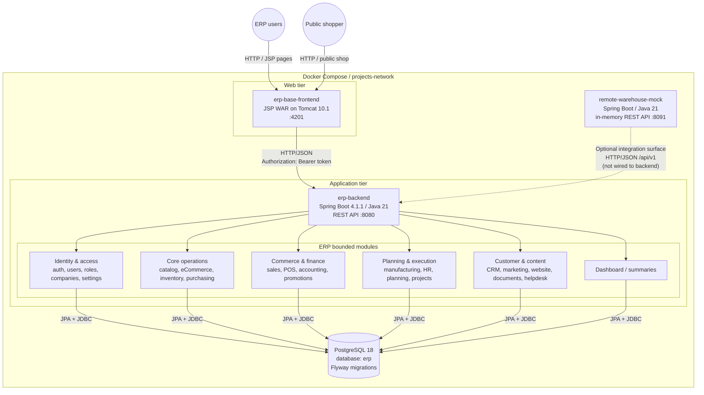
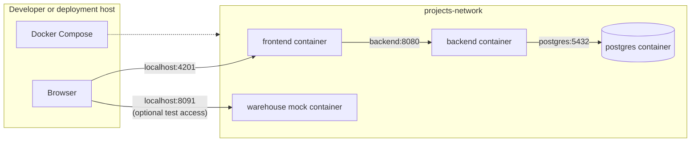

# ERP system architecture

This is the current repository architecture (as deployed by
`docker-compose.yml`). The diagram distinguishes the implemented request path
from the standalone warehouse mock, which currently exposes an API but is not
called by the ERP backend.

## Runtime responsibilities

| Component | Responsibility | Data ownership |
| --- | --- | --- |
| `erp-base-frontend` | Server-rendered JSP pages, session handling, module navigation, and backend HTTP client | Browser session and short-lived backend token |
| `erp-backend` | REST API, validation, authorization, business workflows, PDF invoice generation, and persistence | All ERP business data |
| PostgreSQL | Transactional relational store | Durable system of record |
| Flyway | Versioned schema evolution | 48 migrations currently in the repository |
| `remote-warehouse-mock` | Local integration-test stand-in for product and stock availability | Static in-memory dataset; resets on restart |

## Main request flow

1. A user or shopper connects to the frontend on port `4201`.
2. The JSP application calls the backend over the internal Compose network at
   `http://backend:8080`.
3. Login is handled by the backend under `/api/v1/auth`; the frontend keeps the
   returned bearer token in the server-side HTTP session and forwards it on
   subsequent backend calls.
4. Spring controllers route requests into the ERP modules under
   `/api/v1/*`.
5. Module services and repositories read or update PostgreSQL. Flyway applies
   migrations before normal persistence operations.

## Deployment topology

Published ports:

- `4201 -> frontend:8080`
- `8080 -> backend:8080`
- `5434 -> postgres:5432`
- `8091 -> remote-warehouse-mock:8080`

## Module map

The backend is a modular monolith: modules are package-separated inside one
Spring Boot process and share one PostgreSQL schema. The frontend is a
separate deployable that presents the module pages.

| Area | Backend package / API prefix |
| --- | --- |
| Identity and administration | `users`, `companies`, `settings`, `config` |
| Catalog and stock | `catalog`, `inventory`, `purchase` |
| Revenue and finance | `sales`, `pos`, `accounting`, `promo` |
| Operations and workforce | `manufacturing`, `hr`, `planning`, `projects` |
| Customer and content | `crm`, `marketing`, `website`, `documents`, `helpdesk` |
| Cross-module views | `dashboard` |

The architecture is intentionally shown as a modular monolith rather than as
microservices: only the frontend, backend, database, and warehouse mock are
separate processes in the current Compose setup.
