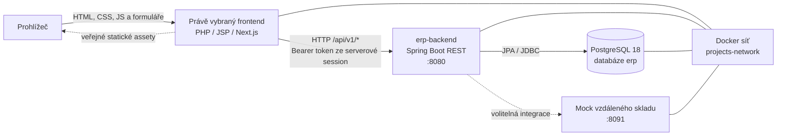

# Architektura ERP

Tato složka obsahuje architektonické diagramy jednotlivých aplikací ERP.
Diagramy jsou zapsané v Mermaid, takže se v prostředích s podporou Mermaid
(například GitHub) zobrazí jako obrázky přímo z Markdownu.

## Systémové přehledy

| Dokument | Co popisuje |
| --- | --- |
| [Backend](./erp-backend.md) | REST API, autorizaci, doménové moduly, databázovou vrstvu a migrace |
| [Next.js – React](./erp-base-nextjs.md) | První React frontend s klientskými moduly a serverovou API proxy |
| [JSP frontend](./erp-base-frontend.md) | Legacy Java Servlet/JSP WAR aplikaci na Tomcatu |
| [Next.js 2 – Twig.js](./erp-base-nextjs2.md) | Věrný serverový přepis PHP šablon a formulářů |
| [Next.js 3 – React/TSX](./erp-base-nextjs3.md) | Serverové vykreslování běžných React komponent bez Twig |
| [PHP – Symfony](./erp-base-php.md) | Symfony frontend, Twig šablony, session a klienta backendového API |

## Společný provozní kontext

Každá frontendová varianta obsluhuje stejné ERP API; business logika a trvalá
ERP data patří backendu a databázi, nikoli frontendům. Frontend obvykle
zprostředkovává přihlášení a server-side API volání, aby přístupový token
nebyl uložený v prohlížeči.

### Varianty frontendu

| Projekt | Renderování | Serverová technologie | Uživatelská session |
| --- | --- | --- | --- |
| `erp-base-nextjs` | React přes Next.js App Router | Node.js BFF a API proxy | Opaque cookie + serverové session soubory |
| `erp-base-frontend` | JSP | Java Servlet na Tomcatu | Servlet `HttpSession` |
| `erp-base-nextjs2` | HTML z Twig.js šablon | Node.js route handler | Opaque cookie + serverové session soubory |
| `erp-base-nextjs3` | React/TSX HTML přes SSR | Node.js route handler | Opaque cookie + serverové session soubory |
| `erp-base-php` | Twig | PHP 8.4 + Symfony 7.4 | Symfony session cookie |

Compose soubory jednotlivých variant znovu používají služby backendu,
PostgreSQL a mock vzdáleného skladu. Varianty frontendu sdílejí některé
publikované porty; současně spouštějte pouze jednu variantu. Konkrétní
konfiguraci a datové hranice uvádí dokument daného projektu.
