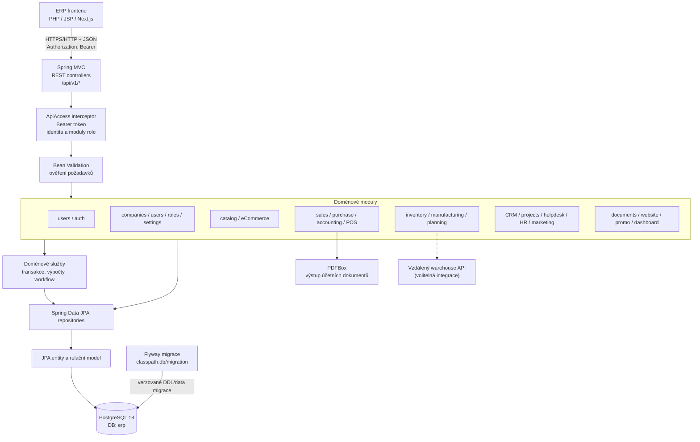

# Architektura `erp-backend`

Spring Boot REST API je autoritativní vrstva pro ERP pravidla, autorizaci
a trvalá obchodní data. Frontendy komunikují s backendem přes `/api/v1/*`;
backend komunikuje s PostgreSQL. Frontendové sessions ani HTML šablony nejsou
součástí backendu.

## Komponentní diagram



## Vrstvy a odpovědnosti

1. **HTTP/API:** kontrolery v balíčcích podle doménového modulu přijímají
   JSON požadavky, mapují výsledky a HTTP statusy. API je pod `/api/v1/`.
2. **Přístup a validace:** `WebConfig` registruje `ApiAccess` pro API cesty.
   Přístupová vrstva zpracovává Bearer token, identitu uživatele a oprávnění
   role/modulů; vstupy ověřují validační anotace a doménové kontroly.
3. **Doménové operace:** služby zajišťují pravidla napříč entitami a
   transakční zápisy. Příklady zahrnují skladové pohyby, ceny a účetní PDF.
4. **Persistence:** Spring Data JPA repository rozhraní pracují s JPA
   entitami; PostgreSQL je zdrojem trvalých ERP dat.
5. **Schéma:** Flyway provádí dopředné verzované SQL migrace. Hibernate
   schéma při startu validuje (`ddl-auto: validate`), sám jej nevytváří.

## Přihlášení a chráněný API požadavek

```mermaid
sequenceDiagram
    actor User as Uživatel
    participant UI as Frontend server
    participant Auth as AuthController
    participant Access as ApiAccess
    participant DB as PostgreSQL
    participant API as Doménový controller

    User->>UI: Přihlašovací formulář
    UI->>Auth: POST /api/v1/auth/login
    Auth->>DB: Najít uživatele a ověřit hash hesla/stav
    DB-->>Auth: Aktivní uživatel a role
    Auth->>Auth: Vystavit access token
    Auth-->>UI: Token, profil, role
    Note over UI: Token uloží serverová session;<br/>prohlížeč obdrží pouze session cookie.
    User->>UI: Požadavek stránky nebo formuláře
    UI->>Access: GET/POST /api/v1/{modul} + Bearer
    Access->>Access: Ověřit token a oprávnění modulu/akce
    Access->>API: Předat ověřenou identitu
    API->>DB: Číst/zapsat přes repository a JPA
    DB-->>API: Výsledek
    API-->>UI: JSON/PDF + HTTP status
    UI-->>User: HTML/redirect/výsledek formuláře
```

`POST /api/v1/auth/logout` revokuje zaslaný token. `GET /api/v1/auth/me`
vrací aktuální identitu a čitelný seznam modulů. Frontendy mohou navíc při
vstupu do modulu provést read-check, ale backend zůstává autoritou pro každou
chráněnou API operaci.

## Doménová mapa

Backend je rozdělen do balíčků odpovídajících API a doméně:

- **Identity/access:** `users` (uživatelé, role, přihlášení a přístupová
  pravidla), `companies`, `settings`.
- **Produkty/prodej:** `catalog`, `sales`, `purchase`, `accounting`, `pos`,
  `promo`.
- **Provoz:** `inventory`, `manufacturing`, `planning`, `hr`.
- **Zákazníci a spolupráce:** `crm`, `projects`, `helpdesk`, `marketing`,
  `documents`, `website`, `dashboard`.

Účetní PDF generuje backend přes PDFBox. PostgreSQL se konfigurují proměnnými
`DB_URL`, `DB_USERNAME`, `DB_PASSWORD`; výchozí JDBC URL míří na službu
`postgres:5432/erp`. Backend naslouchá na portu `8080`.

## Build a provoz

Docker image se sestavuje jako Maven build stage (Java 21) a runtime je
Temurin JRE 21. Hlavní Compose konfigurace čeká na healthcheck PostgreSQL
před startem backendu. Testy používají Spring Boot Test a Testcontainers pro
izolované PostgreSQL integrační testy.
