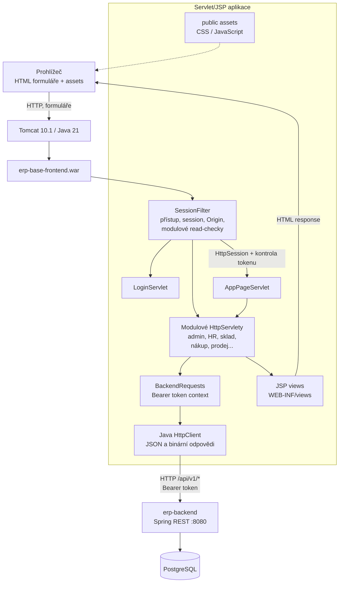

# Architektura `erp-base-frontend` (legacy JSP)

Tento projekt je Java Servlet/JSP WAR frontend na Tomcatu. Nejde o Spring
Boot backend: je to samostatná webová aplikace, která drží uživatelskou
`HttpSession`, vykresluje JSP a volá `erp-backend` přes Java `HttpClient`.

## Komponentní diagram

## Požadavek modulu

1. Tomcat předá HTTP požadavek anotovanému servletu přes `SessionFilter`.
2. Filtr nastaví UTF-8 a bezpečnostní/no-cache hlavičky, odmítne mutaci bez
   stejného Originu, kontroluje session expiraci a chráněné cesty.
3. Pro GET do modulu provede read-check přes odpovídající API endpoint; při
   odpovědi `403` přesměruje uživatele do launcheru.
4. Token uložený v `HttpSession` se předá přes `BackendRequests` do servletu.
   Servlet použije Java `HttpClient` pro JSON API požadavek a vloží výsledek
   do request atributů.
5. Servlet forwarduje do JSP v `WEB-INF/views`; JSP vytváří HTML stránky a
   formuláře. POST servlet validuje/mapuje a zapíše přes backend, poté obvykle
   vrací redirect s feedbackem.

## Propojený model frontend + backend

Zde je servletový request flow propojený s autentizací, oprávněními a
persistence `erp-backend`. Detail vrstev backendu je v
[samostatném dokumentu backendu](./erp-backend.md).

```mermaid
flowchart LR
    Browser["Browser<br/>HTML form + JSP page"]

    subgraph Frontend["erp-base-frontend · WAR / Tomcat 10.1"]
        Tomcat["Tomcat HTTP server"]
        Filter["SessionFilter<br/>Origin + route guard<br/>module read-check"]
        Login["LoginServlet"]
        Servlet["Module HttpServlets<br/>users / inventory / purchase / ..."]
        Session[("Servlet HttpSession<br/>backend token + user")]
        Requests["BackendRequests<br/>Bearer propagation"]
        Client["Java HttpClient"]
        JSP["JSP views<br/>WEB-INF/views"]
    end

    subgraph Backend["erp-backend · Spring Boot REST /api/v1"]
        AuthApi["AuthController<br/>login / me / logout"]
        Access["ApiAccess<br/>token + role/module checks"]
        ApiControllers["Domain REST controllers<br/>users / catalog / inventory /<br/>purchase / sales / HR / ..."]
        Services["Domain services<br/>business rules + transactions"]
        Repositories["Spring Data JPA repositories"]
        Model["JPA entities / domain model"]
        UserRepo["UserRepository"]
        Flyway["Flyway migrations"]
        DB[("PostgreSQL 18<br/>ERP data")]
    end

    Browser -->|"HTTP GET/POST"| Tomcat --> Filter
    Filter -->|"login route"| Login
    Login -->|"POST /api/v1/auth/login"| AuthApi
    AuthApi --> UserRepo --> DB
    AuthApi -->|"token stored server-side"| Session
    Filter -->|"authenticated request"| Servlet
    Session --> Requests --> Client
    Servlet --> Client
    Client -->|"Bearer + /api/v1/*"| Access
    Access --> ApiControllers
    ApiControllers --> Services
    ApiControllers -.->|"direct repository operations"| Repositories
    Services --> Repositories
    Repositories --> Model --> DB
    Flyway -->|"schema/data versions"| DB
    Servlet -->|"forward request attributes"| JSP
    JSP -->|"server-rendered HTML"| Browser
```

## Balíčky a provozní model

- `base`: session/access filter, login/logout a launcher.
- Jednotlivé Servlet třídy pokrývají administraci, účetnictví, CRM, HR,
  sklad, nákup, prodej, katalog/eCommerce, helpdesk, projekty a další moduly.
- JSP šablony a assety zůstávají uvnitř WAR; v prohlížeči není samostatná
  React aplikace ani browser-to-backend token.
- Backend URL se čte z `BACKEND_URL` (výchozí `http://localhost:8080`).
  Přílohy a PDF mohou být přenášeny jako binární HTTP response.

Build vytváří `erp-base-frontend.war` pomocí Maven/Java 21 a kopíruje jej jako
ROOT aplikaci do Tomcat 10.1. V `docker-compose-JSP.yml` je host port `4201`
mapován na Tomcat `8080`; backend je na `8080` a PostgreSQL na `5434`.

> Historická poznámka: README uvnitř projektu může popisovat jiný stav než
> jeho aktuální Maven WAR/Servlet zdrojový kód. Tento diagram vychází z
> `pom.xml`, `Dockerfile`, `web.xml` a aktuálního Java/JSP stromu.
