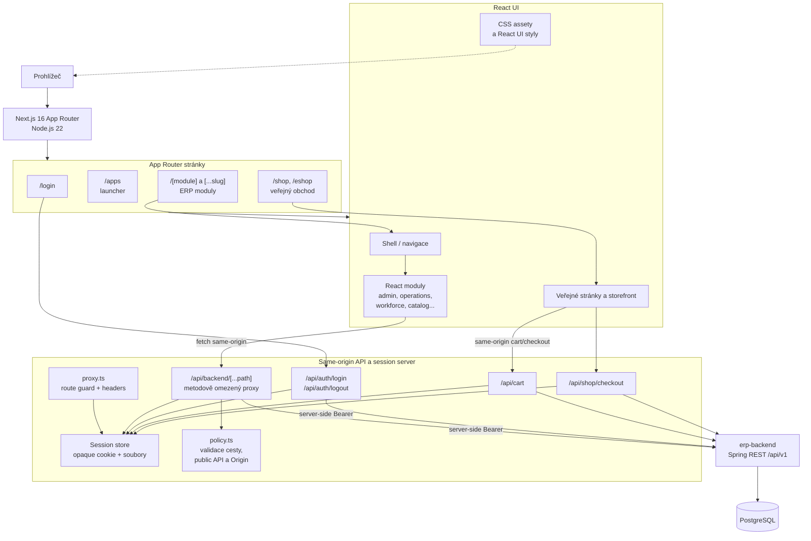
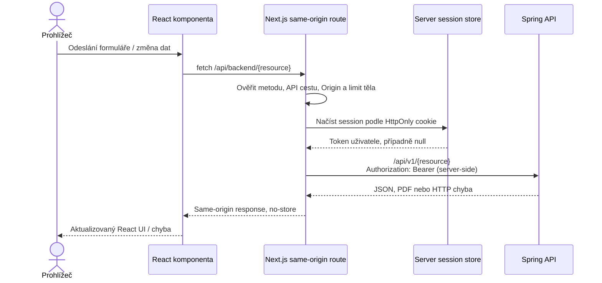

# Architektura `erp-base-nextjs`

První React varianta je Next.js App Router frontend s klientskými React moduly
a serverovým Backend-for-Frontend (BFF). Prohlížeč volá pouze same-origin
frontendové API; přístupový token se připojuje až na serveru při volání
Spring API.

## Komponentní diagram

## Tok stránky a API

- App Router skládá stránky pro přihlášení, launcher, jednotlivé ERP moduly
  a veřejný e-shop. Sdílený `Shell` poskytuje navigaci a session profil.
- Klientské React komponenty používají `src/lib/client-api.ts`. Ten posílá
  požadavky na `/api/backend/*`; UI nedostává backend token ani nevolá API
  host přímo.
- Catch-all BFF route ověřuje cestu, metodu, Origin a session, omezuje velikost
  request body, doplní Bearer token a přepošle JSON/binary response z
  `/api/v1/*`. Explicitní veřejná API výjimka slouží anonymním stránkám.
- Login/logout route oddělují autentizaci. Cart/checkout routes ukládají
  anonymní košík a údaje doručení na serveru a volají backend jen pro potřebná
  data nebo vytvoření objednávky.

## Session a hranice důvěry

Session soubor obsahuje backend token, jméno/roli a expiraci. Prohlížeč drží
pouze náhodné opaque ID v HttpOnly, SameSite cookie; samotný token není
v localStorage ani React state. Session store používá soubory s omezenými
právy a limity absolutní i idle expirace. `proxy.ts` přesměruje neautorizované
vstupy do chráněných UI cest na login; API route nezávisle kontroluje session.

PostgreSQL a obchodní pravidla nejsou součást frontendové persistence.
Statické CSS je servírováno z `public/assets` a nové sdílené React styly
doplňují původní vzhled. Více instancí vyžaduje sdílené úložiště sessions
a distribuované zamykání.

## Běh

Compose varianta `docker-compose-NEXTJS.yml` staví samostatný Node.js 22
standalone image; frontend je na portu `3000`, backend na `8080` a PostgreSQL
na host portu `5434`. Frontendová a backendová služba komunikují přes
`projects-network`. V lokálním vývoji může `BACKEND_URL` výchozí hodnotou
ukazovat na `http://localhost:8080`.
