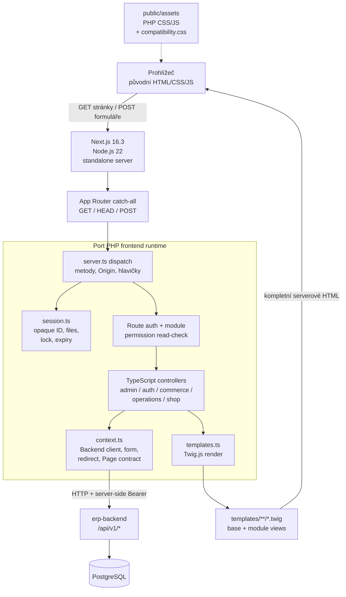
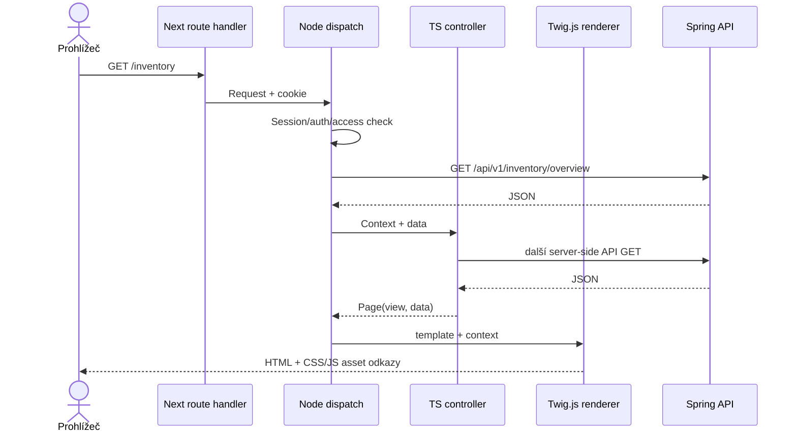

# Architektura `erp-base-nextjs2` (Twig.js)

Tato varianta přenáší PHP controller a template tok do TypeScriptu/Node.js.
Next.js poskytuje HTTP server a route handler; vlastní dispatch mapuje URL
do portovaných controllerů a Twig.js server-side renderuje HTML z běžných
Twig šablon. PHP interpreter v runtime není potřeba.

## Komponentní diagram

## Zpracování požadavku

- Vstupní `src/app/[[...path]]/route.ts` předává GET/HEAD/POST do centrálního
  `dispatch`. Dispatch ověřuje metodu, původ mutací a session, načítá
  `FormData`, chrání privátní cesty a provádí API read-check modulu.
- Rodiny TypeScript controllerů zpracují původní cesty a formulářová pole,
  zavolají `Backend` helper a vrátí buď `Response` (redirect/PDF/error),
  nebo `Page` s názvem Twig šablony a daty.
- `templates.ts` vykreslí dokument na serveru; prohlížeč obdrží tradiční HTML.
  Nepoužívá React hydration. Tím zůstává kompatibilní původní imperative
  JavaScript a markup hooky.
- Backend API komunikace je server-to-server pod `/api/v1/*`; prohlížeč
  backend token nevidí. Negativní backend statusy se mapují na původní
  formulářový feedback/redirect nebo dokumentovou odpověď.

## Session, assety a nasazení

Serverová session ukládá token, profil a podle potřeby i košík/doručení.
Prohlížeč drží náhodné opaque HttpOnly/SameSite cookie. Session se obnovuje
při aktivitě, má idle a absolutní expiraci a zapisuje se atomicky do souborů.
Při přihlášení/odhlášení se identifikátor rotuje.

Origin guard chrání mutující požadavky; security headers a `no-store`
chrání dynamické stránky. Původní PHP CSS/JavaScript jsou statické soubory
v `public/assets`, k nim se připojují úzce vymezené layout compatibility
styly. HTML struktura formulářů a ID/class hooky jsou zachovány.

Compose soubor `docker-compose-NEXTJS2.yml` používá vlastní session volume
`erp-nextjs2-sessions`, host UI port `3000`, backend `8080` a PostgreSQL
`5434`. File session store předpokládá jednu instanci frontendu, dokud nebude
nahrázen sdíleným úložištěm s distribuovaným zámkem.
