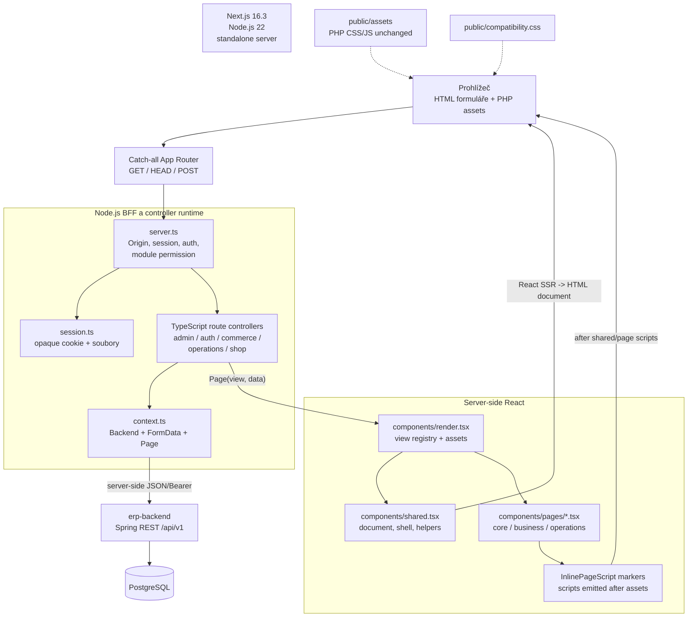
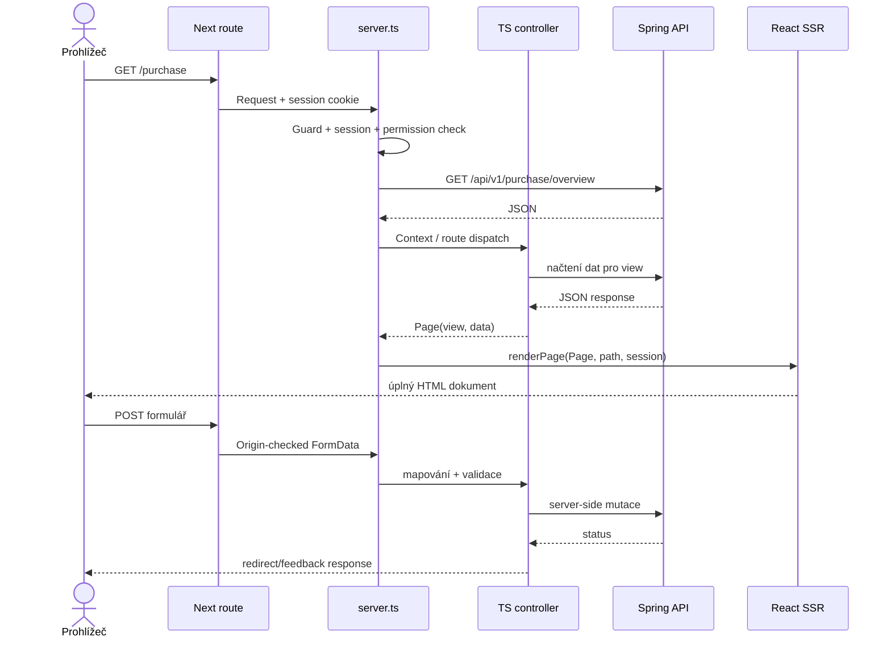

# Architektura `erp-base-nextjs3` (React/TSX, bez Twig)

`erp-base-nextjs3` zachovává serverový request/response model a TypeScript
controller port z varianty Next.js 2, ale místo Twig souborů vrací běžné
React TSX komponenty vykreslené na serveru. React komponenty nahrazují
templating vrstvu; browser-side hydration ani Twig runtime nejsou potřeba.

## Komponentní diagram

## Vykreslení stránky

1. Route handler předá request do dispatcheru, který kontroluje Origin,
   session, přihlášení a oprávnění modulu.
2. TypeScript controller přečte query/form data, volá backend přes serverový
   `Backend` klient a sestaví `Page` (`view`, `data`, HTTP status).
3. Registry v `render.tsx` namapuje `view` na pojmenovanou React komponentu,
   stránkové styly a skripty. `AppDocument` obalí stránky společným HTML
   dokumentem, sidebar/topbar shell nebo veřejnou/login variantou.
4. React server renderer vrátí statické HTML. `InlinePageScript` dovoluje
   přesunout potřebné inline chování za společné a stránkové skripty, aby se
   zachovalo pořadí jako v PHP stránce.
5. Prohlížeč používá tradiční GET/POST formuláře a originální JavaScript.
   React komponenty se po načtení nehydratují.

## Bezpečnostní a datové hranice

Opaque HttpOnly session cookie odkazuje na serverový session soubor, který
obsahuje token, roli/profil a stav guest cart/doručení. Token neopouští
server-side controller/Backend klient. Node runtime spravuje rotaci,
idle/absolutní expiraci a same-origin guard pro POST. Samotná práva modulů
a validace business pravidel znovu vynucuje backend.

CSS/JavaScript jsou kopie původních PHP assetů; layout změny jsou oddělené
v `compatibility.css`. Veřejné routy shop a web/public nepoužívají přihlášený
app shell. Žádné `.twig` soubory ani Twig balíček nejsou součástí projektu.

`docker-compose-NEXTJS3.yml` spouští UI na `3000`, backend na `8080`,
PostgreSQL na host portu `5434` a warehouse mock na `8091`. Vlastní volume
`erp-nextjs3-sessions` je oddělen od sessions ostatních frontendu variant.
