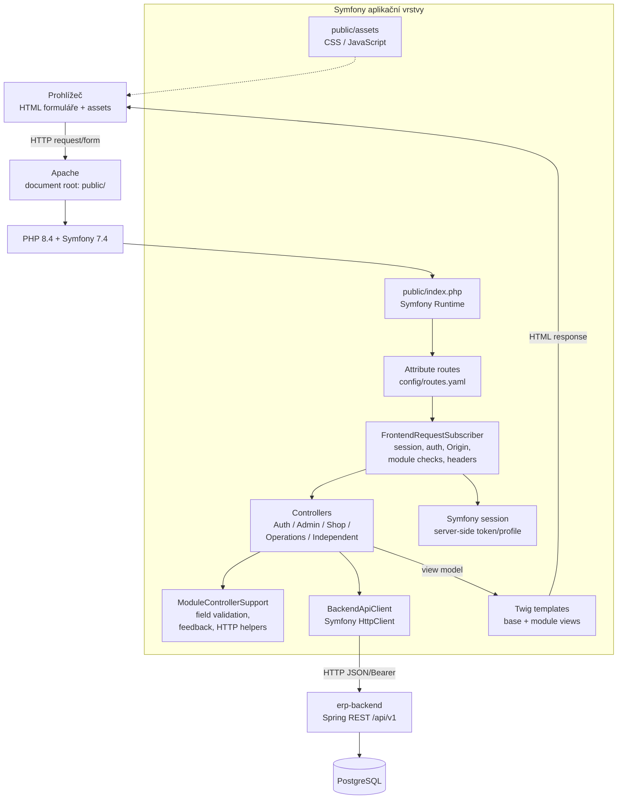
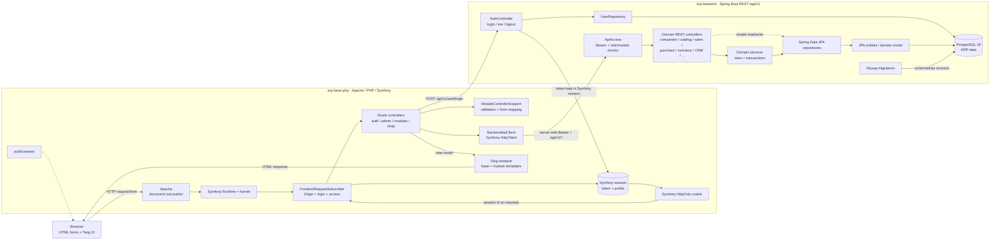
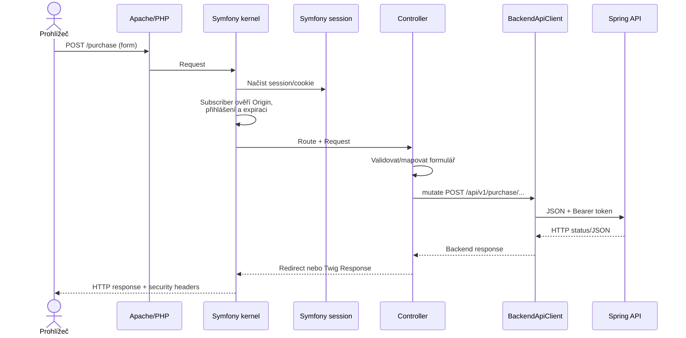

# Architektura `erp-base-php` (Symfony)

PHP projekt je server-rendered frontend postavený na Symfony 7.4, PHP 8.4
a Twig. Jeho aplikační role je BFF: zpracovává browser routy, session,
formuláře a HTML; obchodní operace a trvalá data deleguje do Spring backendu.

## Komponentní diagram

## Request lifecycle

1. Apache směruje požadavky do `public/`; `public/index.php` zavádí Symfony
   Runtime. Attribute route definice v `src/Controller` mapují URL a metody.
2. `FrontendRequestSubscriber` na hlavním requestu ověří session lifetime,
   origin mutací a login pro privátní cesty. GET vstup do modulu může ověřit
   oprávnění read požadavkem na odpovídající backend endpoint.
3. Controller načte Twig context nebo validuje formulářové hodnoty
   (`ModuleControllerSupport`), zavolá `BackendApiClient` a vrátí HTML,
   redirect, PDF/binary nebo chybu.
4. `BackendApiClient` povoluje pouze `/api/v1/*`, používá timeouty, připojí
   Bearer token ze Symfony session a volá `BACKEND_URL`.
5. Response subscriber nastaví no-cache a bezpečnostní hlavičky pro dynamické
   stránky; statické `/assets/` obsluhuje přímo Apache.

## Propojený model frontend + backend

Kombinovaný diagram ukazuje, jak Symfony request a `BackendApiClient` vstupují
do stejného REST/auth/domain/persistence toku. Backendové vrstvy a moduly jsou
detailně popsány v [dokumentu backendu](./erp-backend.md).

## Session, views a deployment

Symfony framework nastavuje HttpOnly, SameSite=Lax cookie (Secure je
automaticky navázán na HTTPS). Serverová session obsahuje backend token,
uživatelský profil a časovou expiraci; po neaktivitě nebo absolutní expiraci
se invaliduje. Prohlížeč backend token nedostává.

Twig šablony v `templates/` dědí společný `base.html.twig`; `public/assets`
obsahuje UI styly a skripty. Controller groups pokrývají autentizaci,
administraci, samostatné moduly, operace, eCommerce a storefront.

Docker image skládá Composer vendor dependencies a Apache/PHP runtime
(`APP_ENV=prod`, `APP_DEBUG=0`). `BACKEND_URL` se předává přes environment.
V `docker-compose-PHP.yml` je UI host port `4201` → kontejner port `80`;
backend je `8080`, PostgreSQL `5434`. PHP frontend není databázovým klientem
a sám ERP tabulky nemění.
